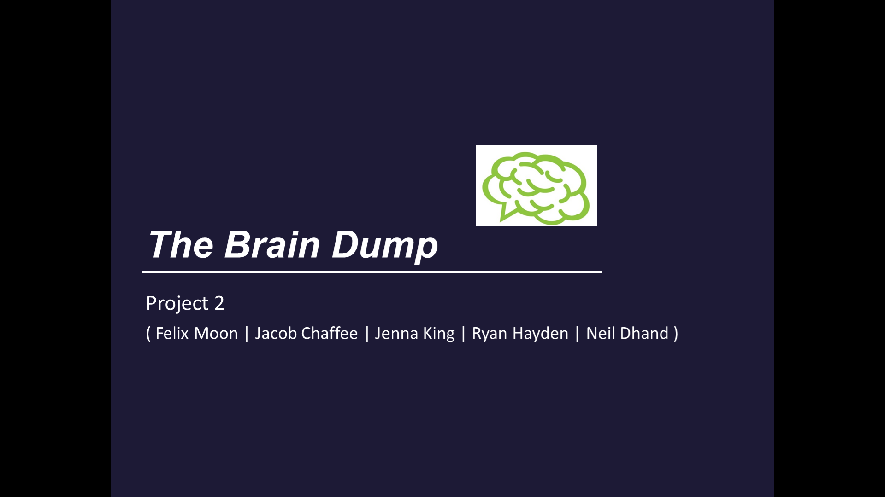
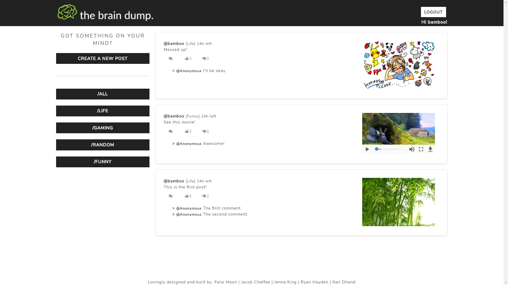
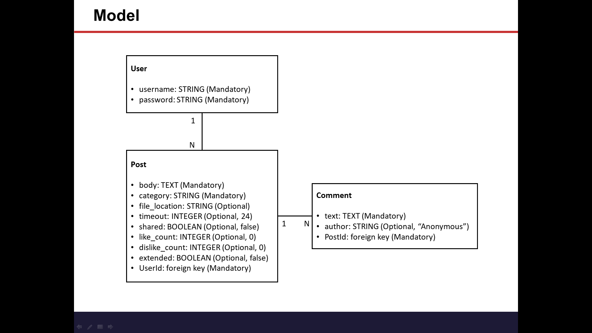
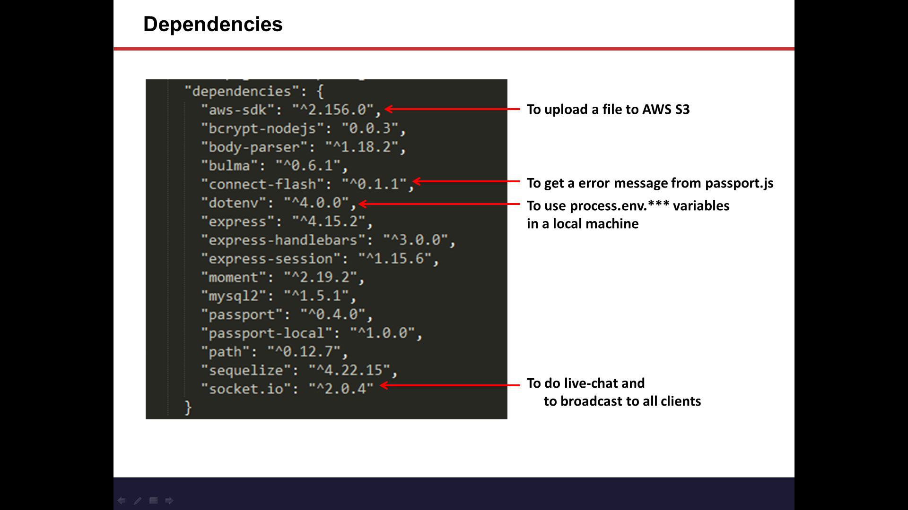
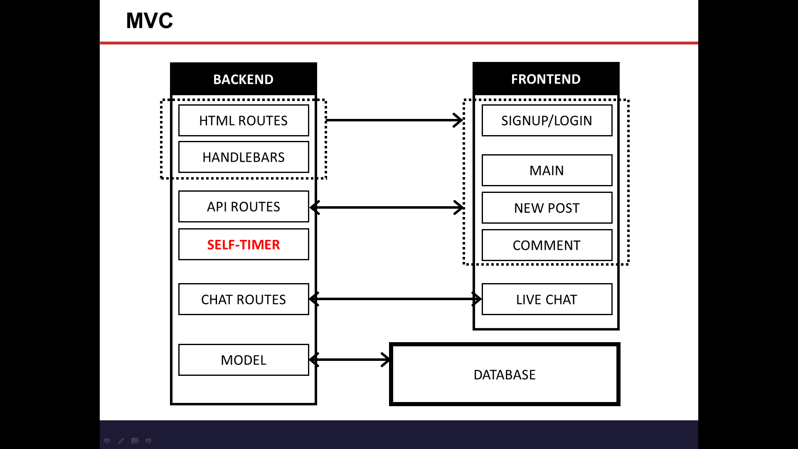
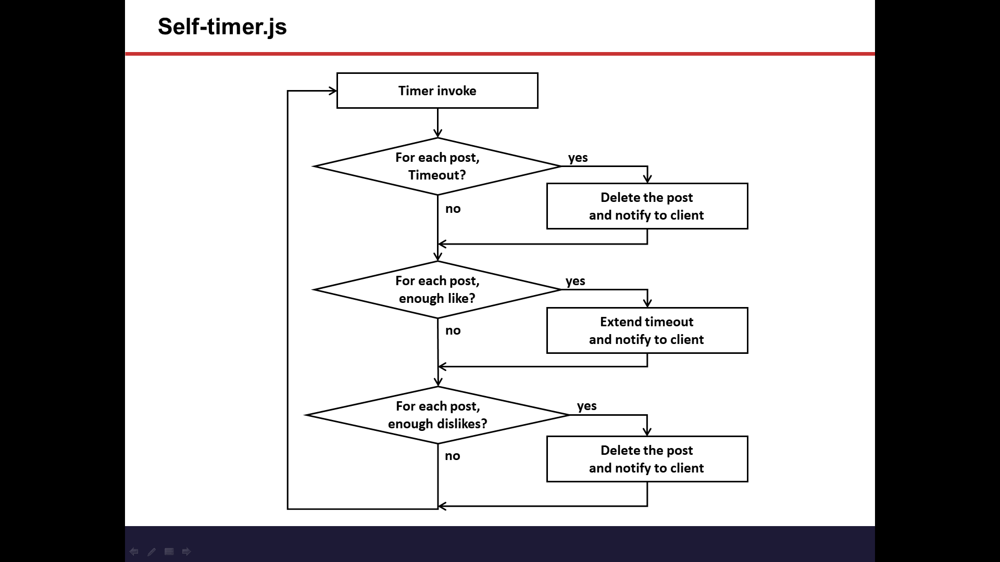

# The Brain Dump

### Overview

Our idea is to make a bulletin board/reddit kind of social media app for all the things you wish you could say, but can't. The users will create a login, and then be directed to a timeline screen where users can post ideas, pictures, or other files that they wish to share on the internet with each post disappearing after 24 hours.

### Team

* Ryan Hayden: Lead, Frontend
* Neil Dhand: Backend
* Felix Moon: Backend / Merging Code
* Jacob Chaffee: Frontend 
* Jenna King: Backend / Troubleshoot

